# Four Seasons Memory Game

Four Seasons is a relaxing memory game with changing seasons. 

This website targets people of any age looking for an easy game without complex rules.

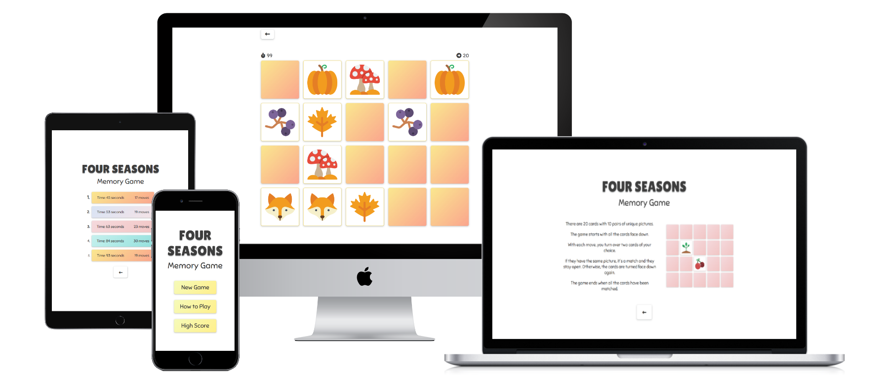

## Contents

* [Features](#features)
    * [Menu](#menu)
      * [Game Name](#game-name)
      * [Buttons](#buttons)
    * [Main Menu](#main-menu)
    * [How To Play](#how-to-play)
    * [High Score](#high-score)
    * [Theme Select](#theme-select)
    * [Game](#game)
      * [Game Screen](#game-screen)
      * [Result Screen](#result-screen)
      * [Leave Dialog](#leave-dialog)
* [Responsive Design](#responsive-design)
* [Wireframes](#wireframes)
* [Design](#design)
    * [Colors](#colors)
    * [Typography](#typography)
* [Testing](#testing)
    * [Manual Testing](#manual-testing)
    * [Validation](#validation)
    * [Bugs](#bugs)
* [Deployment](#deployment)
    * [Development process](#development-process)
* [Credits](#credits)
* [Acknowledgments](#acknowledgments)

## FEATURES

### Menu
- The menu has a consistent layout that is easy to navigate. 
- It consists of the main menu, theme selector, how-to-play, high scores, and end-of-game screens. 
- At the bottom of each page, there is a go-back button allowing the user to navigate to the previous page. 

#### Game Name

- The game name is the first element on all pages, excluding the game screen.
- The name conveys the exact nature of the website, making it clear it is a memory game. 
- The user can immediately expect a game revolving around four changing seasons. 

#### Buttons 
- All buttons have consistent styling, differing only in their background color.
- Main buttons are colorful, and the secondary buttons have a white background. 

### Main Menu
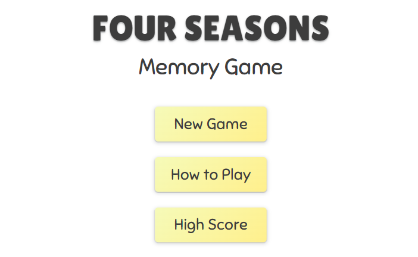
- The main menu is the starting point for a new user.
- From the menu, the user can navigate to a new game, how to play page, or to the high scores.

### How To Play
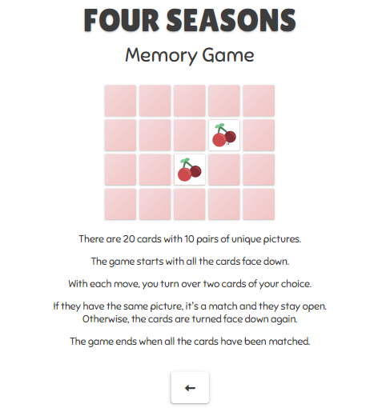
- The How To Play screen consists of a text explaining how to play the game.
- The instructions are complimented by a simple animation showing individual steps. 

### High Score
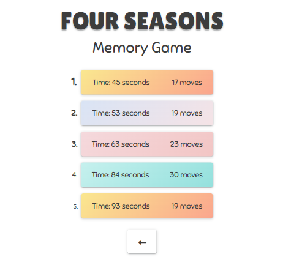
- The high score screen shows the five best scores of the user.
- The scores are ordered by time and the number of moves needed to finish the game.
- The background of each score is in the color of the season the game was played in.

### Theme Select
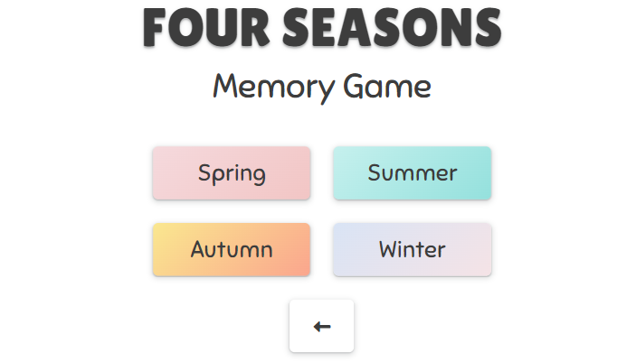
- Before every game, the user can select a season for the game.
- Each season has its unique set of cards with images and colors that match the season.
- All buttons are fully responsive. 

### Game
- The game consists of 10 pairs of cards, 20 cards in total.
- The game starts with all the cards face down.
- The user opens two cards of his choice.
- If two cards match, they stay open. Otherwise, they close and the user can try again until all the cards have been matched. 
- The game ends when all cards have been matched, revealing the final score. 

#### Game Screen
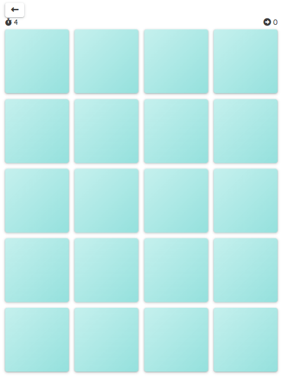
- The game screen presents the user with a game board, timer, and a move counter. 
- In the top left corner, the user can find a back button that allows him to leave the game.
- The game board consists of 20 square, evenly spaced cards. The back of the card carries the color of the chosen season.
- The user can interact with the cards, as indicated by a gentle hover effect.
- Upon clicking, each card flips over, revealing the image on the other side of the card.

#### Result Screen
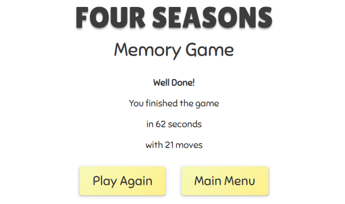
- The end-of-game screen congratulates the user on finishing the game successfully, evoking a pleasant feeling of achievement. 
- It also shows the time and moves the user needed to finish the game.
- At the bottom of the screen are two buttons, allowing the user to start a new game or go back to the main menu.

#### Leave Dialog
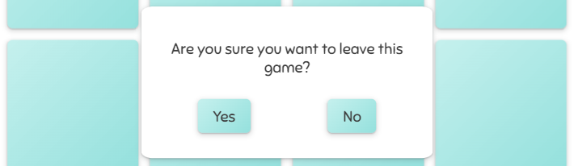
- The leave dialog confirms that the user wants to leave the current game to prevent accidental quitting of the game in progress. 
- The colors of the leaving dialog are matching the current season for the continuous look.

## Additional Features
Features that could be implemented in the future:
- Playing against the computer and other players
- Optional background color for the game board
- Music and sound effects

## Responsive Design
- The entire page has a maximum width of 1140px to ensure a good user experience on larger screens.
- The website uses media queries to optimize the available space on different screen sizes.
- The layout utilizes Flexbox for responsiveness and a CSS grid for the game board.

## Wireframes

Wireframes were created for the mobile and desktop versions of the website with the Program [Balsamiq](https://balsamiq.com/).

[Image of the wireframes](assets/docs/wireframes.png)

## Design

### Colors
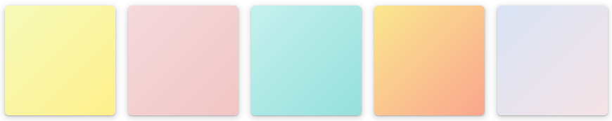  
The website uses a wide range of pastel colors to recreate the feeling of four changing seasons. 
- Spring has a light pink color that represents fresh, blooming flowers.
- Summer has a turquoise blue color that evokes the feeling of bathing in the sea.
- Autumn has a warm orange color that represents fallen leaves.
- Winter has a white color with a hint of blue that represents fresh snow.
- The main menu has a warm yellow color that represents the sun found in every season.

### Typography
- For the page name, the font "Lilita One" was used.
- For the rest of the page, the font "Sniglet" was used.
- The page uses a base font size of 20px for greater readability and accessibility for older audiences.

## Testing

### Manual Testing
- I have tested the desktop and mobile versions of the website with Chrome, Firefox, and Edge on a Windows Computer.
- I have tested the mobile version with Chrome and Firefox on an android device.
- I have tested the mobile version with Safari on an ios device.
- I have shared the website with multiple users to confirm the website functionality on different devices and to get feedback on their experience.

### Validation
#### HTML
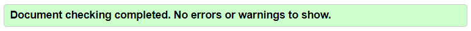     
There were no errors found on any page using the W3C HTML Validator.
#### JS
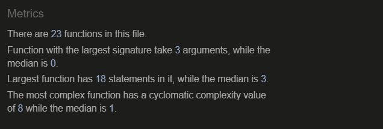  
There were no errors found in the javascript using the JS Hint Validator.
#### CSS
  
There were no errors found in the stylesheet using the W3C CSS Validator.
#### Lighthouse
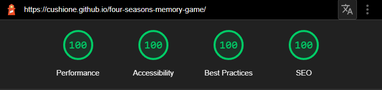   
I used the Chrome Lighthouse tool and received optimal scores for performance, accessibility, best practices, and SEO.

### Bugs
#### Fixed Bugs
- When opening the same card immediately after it has been closed, the image was not showing, revealing only a blank card. Fixed by adding a condition in the time out that removes the image after a card has been closed. This condition checks if the card has been opened again during the time out and, if applicable, skips removing the image. 
- If the user quit a game with an odd number of cards left open, the unmatched card was carried over to a new game. When opening a card in the new game, it was matched against the index of the card from the previous game. If they did not match, the clicked card was closed immediately and the card at the index of the card from the previous game opened showing a blank card. Fixed by resetting the variable storing the index of the first card of a match between games.
- In consecutive games, the timer was incremented in bigger steps. Fixed by clearing the interval that increments the timer every second in between games.  

#### Unfixed bugs
There are no unfixed bugs.

## Deployment

The site was deployed using GitHub pages.

The steps to activate Github pages are as follows:
- Navigate to the settings tab in the GitHub repository.
- In the settings, navigate to the "Pages" tab on the left of the page.
- In the "Build and deployment" section, select "Deploy from a branch" in the source dropdown.
- Select the branch "main" and click on "Save".

The live link can be found here: [Four Seasons Memory Game](https://cushione.github.io/four-seasons-memory-game/)

### Development process

- I started the program and repository by using the [gitpod template](https://github.com/Code-Institute-Org/gitpod-full-template) provided by the Code Insitute.
- Then I regularly staged my changes using the command `git add <filename>` and then committed the staged changes to my local repository using `git commit -m 'short descriptive message here'`.
- Finally, I would push the commits from my local repository up to the GitHub repository using the command `git push`.
- With every push, Github automatically deploys my latest commit from the 'main' branch to the Github pages.

## Credits
- The card icons were created by [Smashicons](https://www.flaticon.com/authors/smashicons) on [Flaticon](https://www.flaticon.com/).
- The timer and move icons were taken from [FontAwesome](https://fontawesome.com/).
- The How-to-play animation was recorded with the program [ScreenToGif](https://www.screentogif.com/).
- The fonts are imported from [Google Fonts](https://fonts.google.com/).
- The favicon was generated using [favicon.io](https://favicon.io/) with a vector graphic from [Public Domain Vectors](https://publicdomainvectors.org/en/free-clipart/Seasons-icons/76143.html).
- I learned about the Durstenfeld shuffle algorithm from a post on [Stack Overflow](https://stackoverflow.com/questions/2450954/how-to-randomize-shuffle-a-javascript-array)
- I learned how to create a flip animation with CSS on [W3School](https://www.w3schools.com/howto/howto_css_flip_card.asp)

## Acknowledgments

I would like to acknowledge the following people who have helped me along the way in completing my first milestone project:
- My husband, Moritz Wach, for his unwavering support, patience, and feedback.
- My mentor, Spencer Barriball, for his guidance and advise.
- My fellow students for their company and encouragement. 
